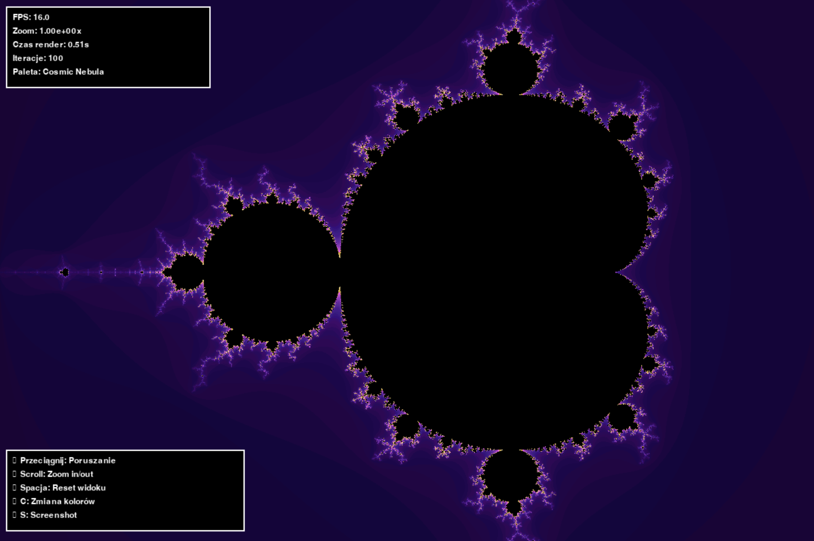

# 🌈 FRAKTAL MANDELBROTA - Interaktywna Aplikacja


**Piękna, interaktywna aplikacja do eksploracji fraktala Mandelbrota z możliwością 'nieskończonego' powiększania!**



## ✨ Funkcje

### 🎯 Główne możliwości

- **'Nieskończone' powiększanie** - zoom do 10^15x!
- **Płynna nawigacja** - przeciągnij myszką aby się poruszać
- **Wielokolorowe palety** - 10 pięknych schematów kolorów
- **Optymalizacja wydajności** - wykorzystanie JIT compilation (Numba)
- **Responsywny interface** - skalowalne okno aplikacji

### 🎨 Palety kolorów

1. **Rainbow** - Klasyczna tęcza z animacją
2. **Ocean Waves** - Błękitne fale oceanu
3. **Fire & Magma** - Ogniste czerwienie i pomarańcze
4. **Electric Plasma** - Neonowe błękity i fiolety
5. **Cosmic Nebula** - Kosmiczne mgławice
6. **Vintage Sepia** - Nostalgiczne brązy
7. **Neon Dreams** - Jasne, nasycone kolory
8. **Ice Crystal** - Lodowe błękity
9. **Sunset Glow** - Ciepłe kolory zachodu słońca
10. **Matrix Code** - Zielona matryca

## 🚀 Instalacja

### Wymagania systemowe

- Python 3.8 lub nowszy
- System Windows/Linux/macOS

### Kroki instalacji

1. **Sklonuj lub pobierz aplikację:**

```bash
# Jeśli używasz git
git clone https://github.com/fortenemy/Mandelbrot-Fractal-PL.git
cd Mandelbrot-Fractal-PL

# Lub po prostu pobierz pliki do predefiniowanego folderu
```

2. **Zainstaluj zależności:**

```bash
pip install -r requirements.txt
```

3. **Uruchom aplikację:**

```bash
python main.py
```

## 🎮 Sterowanie

### 🖱️ Mysz

- **Lewy przycisk + przeciągnij** - Poruszanie po fraktalu
- **Kółko myszy** - Powiększanie/pomniejszanie
- **Scroll w górę** - Zoom in (powiększ)
- **Scroll w dół** - Zoom out (pomniejsz)

### ⌨️ Klawiatura

- **Spacja** - Reset widoku do domyślnego
- **C** - Zmiana palety kolorów
- **S** - Zapisz screenshot
- **+/=** - Zwiększ jakość renderowania (więcej iteracji)
- **-** - Zmniejsz jakość renderowania (mniej iteracji)
- **ESC** - Wyjście z aplikacji

## 📊 Interface użytkownika

### Informacje na ekranie

- **FPS** - Aktualna płynność aplikacji
- **Zoom** - Poziom powiększenia (notacja naukowa)
- **Czas render** - Czas ostatniego renderowania
- **Iteracje** - Jakość obliczeń (więcej = lepsza jakość)
- **Paleta** - Nazwa aktualnej palety kolorów

### Wskazówki sterowania

Aplikacja wyświetla stale pomocne wskazówki w lewym dolnym rogu.

## 🔧 Architektura aplikacji

### Struktura plików

```
fractal/
├── main.py              # Główna aplikacja i interface
├── fractal_engine.py    # Silnik obliczeń matematycznych
├── color_palette.py     # System kolorowania
├── requirements.txt     # Zależności Python
└── README.md           # Ta dokumentacja
```

### Kluczowe klasy

#### `FractalApp` (main.py)

- Główna klasa aplikacji
- Obsługa zdarzeń i interface użytkownika
- Wielowątkowe renderowanie

#### `MandelbrotEngine` (fractal_engine.py) 

- Obliczenia matematyczne fraktala
- Optymalizacja z Numba JIT
- Zarządzanie zoomem i nawigacją

#### `ColorPalette` (color_palette.py)

- 10 różnych palet kolorów
- Animowane efekty kolorystyczne
- Cache kolorów dla wydajności

## ⚡ Optymalizacja wydajności

### Użyte technologie

- **Numba JIT** - Kompilacja Just-In-Time dla obliczeń matematycznych
- **NumPy** - Wydajne operacje na tablicach
- **Threading** - Renderowanie w tle
- **Cache kolorów** - Przyspieszenie kolorowania
- **Adaptacyjne iteracje** - Automatyczne dostosowanie jakości do poziomu zoomu

### Wskazówki wydajności

- Większy zoom = dłuższe renderowanie (to normalne!)
- Użyj **+/-** aby dostosować jakość do swoich potrzeb
- Mniejsze okno = szybsze renderowanie
- Reset widoku (**Spacja**) dla szybkiego powrotu

## 🎯 Eksploracja fraktala

### Ciekawe obszary do odwiedzenia

1. **Główna bulwa** - Centrum przy (-0.5, 0.0)
2. **Seahorse Valley** - Obszar przy (-0.75, 0.1)
3. **Lightning** - Punkt (-1.25, 0.0)
4. **Elephant Valley** - Okolice (0.25, 0.0)
5. **Spiral** - Punkt (-0.7269, 0.1889)

### Techniki eksploracji

- Zacznij od małego zoomu i szukaj interesujących wzorów
- Klikaj w detale które Cię zainteresują
- Eksperymentuj z różnymi paletami kolorów
- Zapisuj screenshoty ciekawych odkryć!

## 📸 Screenshoty

Aplikacja automatycznie zapisuje screenshoty w formacie PNG z timestampem.
Nazwa pliku: `fractal_screenshot_RRRRMMDD_GGMMSS.png`

## 🛠️ Rozwiązywanie problemów

### Częste problemy

**Aplikacja działa wolno:**

- Zmniejsz jakość renderowania klawiszem `-`
- Zmniejsz rozmiar okna
- Upewnij się, że masz najnowszą wersję NumPy i Numba

**Błąd importu modułów:**

- Upewnij się, że zainstalowałeś wszystkie zależności: `pip install -r requirements.txt`

**Aplikacja się zawiesza:**

- To może się zdarzyć przy ekstremalnie dużym zoomie (>10^14)
- Użyj **Spacja** aby zresetować widok

## 🤝 Rozwój aplikacji

### Możliwości

- Dodanie nowych typów fraktali (Julia, Burning Ship)
- Eksport animacji do video
- Więcej palet kolorów
- Moduł ulubionych lokalizacji
- Interface do zmiany parametrów matematycznych

### Wymagania deweloperskie

```bash
pip install pytest black flake8
```

## 📜 Licencja

MIT License - Zobacz pełny tekst w pliku LICENSE

## 👨‍💻 Autor

fortenemy

---

## 🌟 Ciesz się eksploracją nieskończoności

